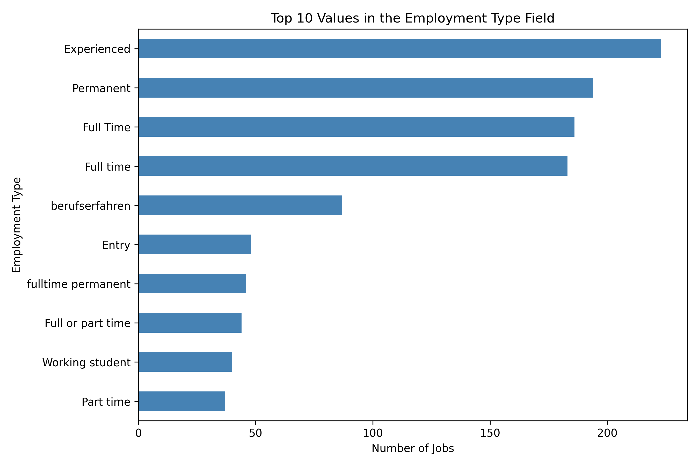

# Analyse von Stellenanzeigen auf der Website Arbeitnow

In diesem Projekt werden Stellenanzeigen von [Arbeitnow](https://www.arbeitnow.com/) gesammelt und analysiert. Untersucht werden unter anderem Arbeitsorte, Unternehmen, Beschäftigungsarten, Stellen-Tags sowie Fähigkeiten, die in den Stellenbeschreibungen erwähnt werden.

## Datenerhebung

Die Stellenanzeigen wurden von den Seiten 1 bis 20 gesammelt. Zuerst wurden die Titel und Links aus den Übersichtsseiten ausgelesen. Anschließend wurden die einzelnen Stellenanzeigen aufgerufen, um weitere Informationen zu erfassen. Nicht mehr verfügbare Anzeigen wurden übersprungen.

Der Datensatz enthält folgende Informationen:

- Stellentitel und Unternehmen
- Arbeitsort und Veröffentlichungsdatum
- Beschäftigungsart und Tags
- Stellenbeschreibung und Link

Die Veröffentlichungsdaten der erfassten Anzeigen liegen zwischen dem 5. August und dem 28. September 2026.

## Daten bereinigung und Analyse

Die Daten aus den beiden CSV-Dateien wurden zusammengeführt. Danach wurden fehlende Werte und doppelte Links überprüft, doppelte Anzeigen entfernt, Textfelder bereinigt und die Veröffentlichungsdaten in ein Datumsformat umgewandelt.

Die Analyse umfasst:

- 
-  Arbeitsorte, Unternehmen und Stellen-Tags
- Den Anteil der als „Remote“ gekennzeichneten Stellen
- Ausgewählte Fähigkeiten in den Stellenbeschreibungen

## Dateien

- `Programmierung_Project.ipynb` – Datenerhebung, Bereinigung, Analyse und Visualisierungen
- `jobs_details_1to10.csv` und `jobs_details_11to20.csv` – gesammelte Stellenanzeigen
- `jobs_clean_1to20.csv` – bereinigter Datensatz für die Analyse
- `*.png` – im Notebook erstellte Diagramme
